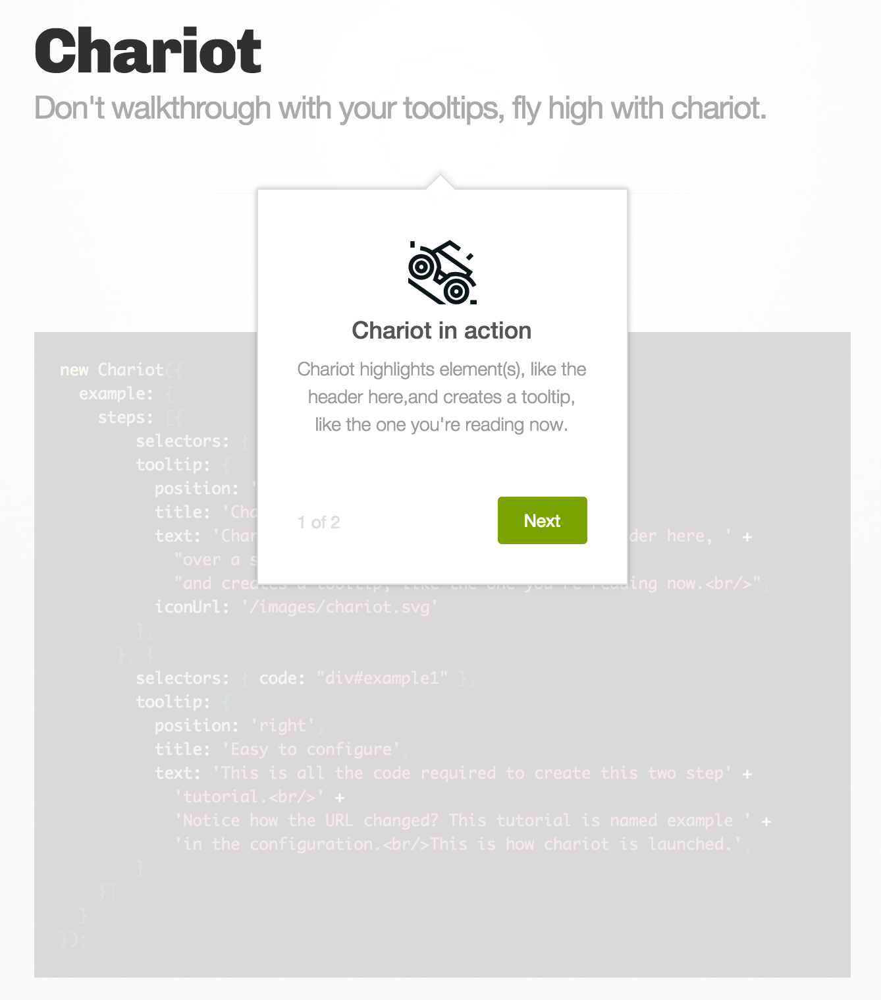

<pre>
   ___    _                         _              _
  / __|  | |_     __ _      _ _    (_)     ___    | |_
 | (__   | ' \   / _` |    | '_|   | |    / _ \   |  _|
  \___|  |_||_|  \__,_|   _|_|_   _|_|_   \___/   _\__|
_|"""""|_|"""""|_|"""""|_|"""""|_|"""""|_|"""""|_|"""""|
"`-0-0-'"`-0-0-'"`-0-0-'"`-0-0-'"`-0-0-'"`-0-0-'"`-0-0-'
</pre>

# Chariot
> Walkthroughs so easy, you might as well be flying in a chariot.

A Javascript library for creating step-by-step tooltip tutorials, using a
background overlay to bring focus to the elements you care about.

# Demo

Visit the [live demo](chariot.zendesk.com).

Or run the project locally, and navigate to
[http://localhost:8080/example/index.html](http://localhost:8080/example/index.html).

# Motivation
We believe that tooltips are better at drawing focus to highlighted elements
on a website when the background is dimmed out.

Existing tooltip overlay solutions don't use overlay backgrounds, or if they
do, they fail to consider when parent containers already have the CSS
`z-index` property set.

(A child element's `z-index` cannot override it's parent's `z-index`).

# Features

- Tutorial kicked off by query parameter in the URL or programmatically
- Overlay hides background and clones your key elements over it
- `z-index` is taken care of
- Programmatic API and configurable callbacks
- Browser support includes every sane browser and IE9+.

# Usage

chariot.js works in global, CommonJS and AMD contexts.

1. First, initialize chariot with tutorial configurations.

	```js
	var config = {
	  example: {
	    steps: [
	    	{
	        	selectors: { header: "header" },
		        tooltip: {
		          position: 'bottom',
		          title: 'Chariot in action',
		          text: 'Chariot highlights element(s), like the header here, ' +
		            "over a semi-transparent overlay, "
		            "and creates a tooltip, like the one you're reading now.<br/>",
		          iconUrl: '/images/chariot.svg'
		        },
      	    	}, {
		        selectors: { code: "div#example1" },
		        tooltip: {
		          position: 'right',
		          title: 'Easy to configure',
		          text: 'This is all the code required to create this two step' +
		            'tutorial.<br/>' +
		            'Notice how the URL changed? This tutorial is named example ' +
		            'in the configuration.<br/>This is how chariot is launched.',
		        }
    		}
	    }]
	  }
	};
	var chariot = new Chariot(config);
	```

2. Launch a tutorial.

	1. Once configured, navigate to the current URL with an appended query parameter `tutorial`, setting
the value to the name of a tutorial defined in your configuration.

	`http://www.example.com?tutorial=example`

	2. or, start a tutorial programmatically:
	`chariot.startTutorial('example');`

The above example (taken from the demo) should display a chariot tooltip like this:



## Configuration

Here's an example on how to configure Chariot:

[Example configuration](example/config.example.js)

## API

If you're already running the project locally, you can view the JSDoc-formatted
documentation at
[http://localhost:8080/docs/global.html](http://localhost:8080/docs/global.html).


#### new Chariot(config)

Creates the chariot instance with a required configuration of tutorials.
Read the [example configuration](example/config.example.js) for more information.

#### chariot.startTutorial(name, onComplete)

Starts the tutorial with the given name, as specified in configuration.
An optional onComplete callback can be provided,
called once the tutorial has gone through all steps.
Note that Chariot can be started via the `tutorial` URL query parameter as well.

#### chariot.endTutorial()

Ends the current tutorial.

# Development
Install node packages.

	npm install

Install the gulp cli.

	npm install -g gulp

To run a simple server:

	gulp connect

This will start a simple server that serves `index.html` at
http://localhost:8080/example/index.html, and loads `chariot.js` onto the page.
The task will also watch your changes and reloads the page as the files are updated.

Run the following style-checker before pushing your branch.

	gulp style

To automatically fix the style errors:

	gulp style-fix

To update the generated docs:

	gulp js-doc

# Test

## Command Line
To run test in command line, run:

	gulp test

## Browser
If you want to test the same test suite in multiple browsers, run:

	gulp testem

The browsers to test can be configured in `testem.yml`, currently it is configured to test in all major browsers (Firefox, Safari, Chrome) and PhantomJS.

# Build
Run the following to build `chariot.js` into thd `/dist` directory.

	gulp

*Do not check in the `dist` directory. Release on github will contain the tarballs with compiled js/css.*

# Release

When you have merge in all your changes from your branch. Run the following **IN MASTER**:

	gulp release

This gulp task will

1. Bump version in package.json, npm-shrinkwrap.json, bower.json
1. Auto-generate documentation with js-doc
1. Package release into the ```release/``` folder
1. Commit the version bump changes in package.json npm-shrinkwrap bower.json
1. Push the bump changes
1. Tag with the new version

After releasing, update the relevant files in your project which uses ChariotJS.
Update version in bower/npm, or copy release/chariot.[min.]js,
release/chariot.[min.]css into your project's ```vendor/``` folder.

# Implementation

Chariot uses the hashchange event to determine if a tutorial query parameter
is present, then starts the corresponding tutorial.

# Copyright and License

Copyright 2014, Zendesk Inc. Licensed under the Apache License Version 2.0, http://www.apache.org/licenses/LICENSE-2.0


